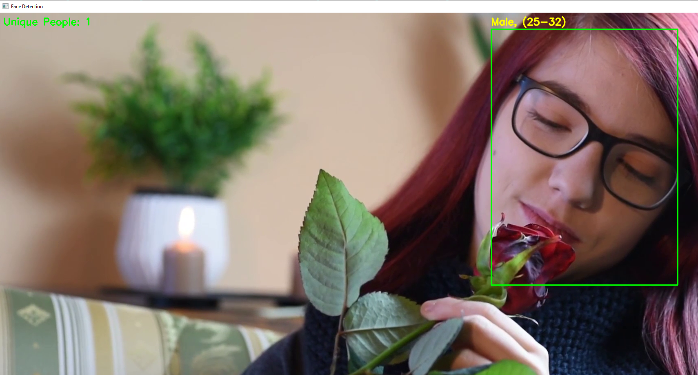

# Разработка веб-сервиса для анализа видеопотока

Данный проект выполнялся командой, перед командой была поставлена цель : В ходе анализа видеопотока необходимо произвести выделение объектов (людей, автомобилей), отслеживание и распознавание признаков.

## Мои задачи на проект:
* Разработать алгоритм подсчета уникальных людей
* Разработать алгоритм подсчета уникальных автомобилей
* Сделать связующий файл между вызовом функций python и JS (файл main)
* Написать статью о проделанной работе

Детали реализации проекта можно прочитать в статье. (https://github.com/Dima239811/object-detection/blob/main/article.pdf)
## Результаты работы
### Алгоритм подсчета людей

### Алгоритм подсчета машин

## Итоги работы
Поставленные задачи были выполнены  

Для подсчета машин и людей был реализован эффективный алгоритм, который основывался на определении координат центра, анализируемого объекта, и отслеживании его перемещения на следующем кадре. Опытным путем было подобрано пороговое расстояние, начиная с которого объект считается новым. 
 
Результаты можно считать положительными. Программа работала, обрабатывая видео и выдавая ожидаемые результаты.  
Но все же трудности возникали. Например, при трекинге машин было тяжело подобрать пороговое расстояние и при видео, на которых разные скорости машин и разное качество камер результаты будут с погрешностью.

## В ходе выполнения проекта приобрел следующие навыки:
-	Понимание принципов работы систем компьютерного зрения
-	Проектирование и реализация эффективных алгоритмов для решения задач подсчета и отслеживания уникальных объектов
-	Понимание архитектурных решений для построения приложений, сочетающих Python и JavaScript
-	Планирование и организация работы над индивидуальным практическим заданием

---
Автор проекта: **Чекалин Дмитрий**

